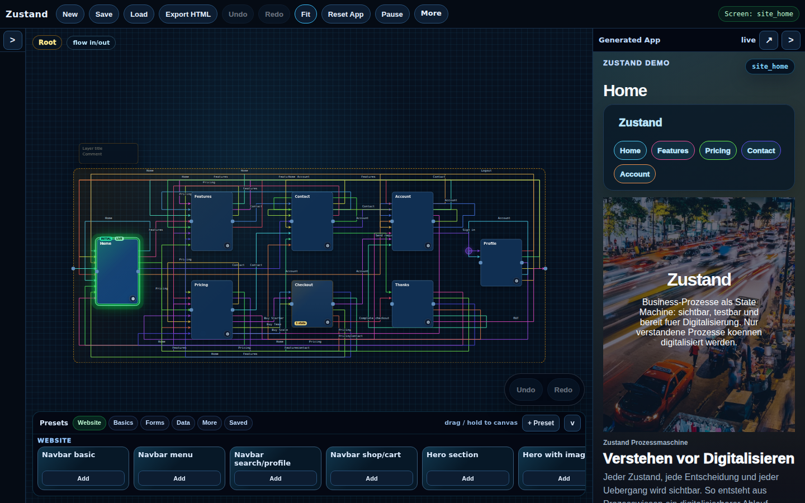
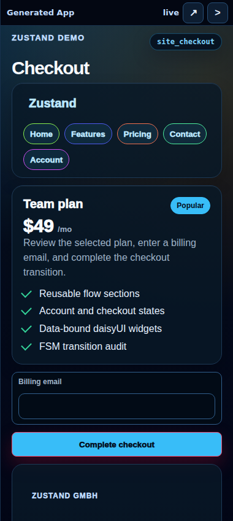
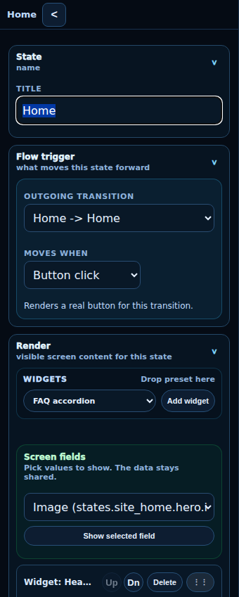

# Digitalisierungsplanung

Zustand ist ein Werkzeug, um Geschäftsprozesse zuerst zu verstehen und danach sauber zu digitalisieren. Der Kern ist keine lose Diagrammfläche, sondern ein echter endlicher Zustandsautomat: States, Transitionen, Daten, Trigger und Benutzeroberfläche liegen in einem gemeinsamen JSON-Modell.

Die Startseite unter `index.html` ist selbst ein exportierter Zustand-Flow. Der Editor liegt in `state.html`.

## Was sich geändert hat

- Die öffentliche Landingpage wurde als deutsche Verkaufsseite für Entscheider neu aufgebaut.
- Der Kontrakt ist schriftlich festgehalten: ein globaler JSON-State/Event-Bus, keine Schattenzustände, keine versteckte Widget-Logik.
- DaisyUI-Presets sind strukturierte, busgebundene Komponenten. Text ist Darstellung, `transitionId` ist Bindung.
- Die MCP/API-Schicht bleibt als steuerbare Schnittstelle für alle relevanten Modellaktionen erhalten.
- README-Screenshots werden aus der echten App erzeugt, damit die Dokumentation nicht vom UI-Stand wegdriftet.
- Smoke- und Kontrakt-Tests schützen Canvas, Proxies, Nested States, Render-Reihenfolge, Presets, Export, API und Laufzeit.

## Warum

Digitalisierung scheitert oft nicht an Software, sondern an unklaren Abläufen. Zustand macht den Ablauf sichtbar, klickbar und prüfbar, bevor Budget in Umsetzung, Agenturen, Integrationen oder Automatisierung fließt.

Ein Prozess ist erst dann digitalisierbar, wenn klar ist:

- welche Zustände es gibt,
- welche Daten den Zustand beschreiben,
- welches Ereignis den nächsten Schritt auslöst,
- welche Bedingungen erfüllt sein müssen,
- welche Benutzeroberfläche der Benutzer an welcher Stelle sieht,
- und welche Daten nach einem Schritt im globalen State stehen.

## Screenshots

Der Editor zeigt Canvas, Vorschau und State-Inspector in einem Arbeitsbereich.



Die Vorschau ist dieselbe FSM als laufende App. Buttons und Widgets feuern echte Transitionen und schreiben über den globalen JSON-Bus.



Der Inspector bearbeitet Trigger, Widgets, sichtbare Felder und gescopte Bus-Daten des ausgewählten States.



## Kontrakt

Es gibt genau eine Quelle der Wahrheit:

```text
globaler JSON-State- und Event-Bus
```

Alles, was Daten oder Ablauf beeinflusst, muss im Modell beschrieben sein und über den offiziellen Laufzeitpfad aus diesem Bus lesen oder in diesen Bus schreiben.

Der vollständige schriftliche Kontrakt steht in [`statereadme.md`](statereadme.md).

Kurzfassung:

- States sind Sichten auf relevante Datenkonstellationen im globalen JSON-Baum.
- Transitionen sind echte Kanten zwischen existierenden States.
- Trigger, Conditions und `set`-Patches sind Modelldaten.
- Render ist nur Sicht auf Modell und Bus.
- DaisyUI ist Skin und Widget-Renderer, nicht die Wahrheit.
- Labels sind Anzeige. IDs sind Bindung.
- Presets erzeugen erst Live-Daten, wenn sie als echter State auf den Canvas gelegt werden.
- Nested States und Boundary-Proxies folgen ausschließlich den echten Drähten.
- Wenn kein echter Out existiert, stoppt die Maschine.

## Anwendung

`state.html` enthält die komplette Hauptanwendung:

- visueller FSM-Canvas mit States, Transitionen, Proxies und Nested Layers,
- State-Inspector für Trigger, Render, Daten, Widgets und Aktionen,
- generierte App-Vorschau,
- DaisyUI-Preset-Katalog,
- Render-Reihenfolge für Komponenten, Data-Wires und Transition-Buttons,
- Fetch-on-enter als State-Effekt,
- Save/Load/Import/Export,
- PWA-Assets und statischer Export.

`index.html` ist die generierte öffentliche Landingpage für `digitalisierungsplanung.de`.
Im Editor kann zusätzlich `state.html?demo=landing` die Hauptseite als bearbeitbare Demo laden; `state.html?demo=zustand` lädt die Werkzeug-Demo.

## Realtime

Der optionale Realtime-Server in `server/` ist nur Transport fuer Runtime-Events.

- WSS-Endpunkt: `wss://realtime.digitalisierungsplanung.de/ws`
- Token-Endpunkt: `https://realtime.digitalisierungsplanung.de/token`
- Marketplace-HTML: `https://realtime.digitalisierungsplanung.de/marketplace.html`
- Marketplace-Index: `https://realtime.digitalisierungsplanung.de/marketplace`
- Preset-Referenzen: `https://realtime.digitalisierungsplanung.de/presets`
- Event-Definitionen: `https://realtime.digitalisierungsplanung.de/events`
- Endpoint-Definitionen: `https://realtime.digitalisierungsplanung.de/endpoints`
- State-Schema: `https://realtime.digitalisierungsplanung.de/state-schema`
- Server-to-server Fire-Endpunkt: `https://realtime.digitalisierungsplanung.de/emit`
- Test-Konsole: `https://realtime.digitalisierungsplanung.de/console.html`
- Aktivierung im Editor: `state.html?room=<room-id>`
- API-Dokumentation: [`docs/realtime-api.md`](docs/realtime-api.md)
- Der App-Contract konsumiert `realtime.*` Events; `/emit` akzeptiert nur angebotene Marketplace-Events.

Realtime erzeugt keine zweite Wahrheit. Der Marketplace auf dem Realtime-Server ist der Werkzeugkasten und die Single Source of Truth fuer angebotene Presets, Events, Endpoints und State-Felder. Der Canvas soll nur konkrete Referenzen speichern, die er wirklich verwendet: zum Beispiel `triggerEvent`, Feldpfade, Room-ID und Endpoint-ID. Er speichert keine Preset-Contracts, keine importierten Endpoint-Definitionen und keine Preset-Instanzen.

Die Bereiche sind strikt getrennt: `/marketplace` liefert nur Links und Counts, `/presets` nur Preset-Refs, `/events` nur Event-Definitionen, `/endpoints` nur Endpoint-Definitionen und `/state-schema` nur globale State-Felder. Eingehende Nachrichten werden als `STATE_BLUEPRINT_REALTIME_EVENT` an die generierte Runtime gegeben, schreiben dort erst in den JSON-Bus und koennen nur dann Transitions bewegen. Der Host behandelt Runtime-Kontext weiter nur als read-only Snapshot.
`state.html` liest Realtime-Presets und Events live vom Server, ohne sie ins Modell oder in exportierte Definitionen zu schreiben.

Server-to-server Emit ist stateless: `/emit` persistiert keine Call-Objekte und haelt keinen fachlichen Zustand. Es akzeptiert nur angebotene Events aus dem Marketplace und broadcastet die Event-Instanz in den Room.

Beispiel:

```js
window.__stateBlueprintRealtime.emit("realtime.canvas.pulse", { stateId: "start" });
```

Passende Transition:

```text
triggerType: realtime
triggerEvent: realtime.canvas.pulse
```

Externes Event feuern:

```bash
curl -X POST https://realtime.digitalisierungsplanung.de/emit \
  -H "authorization: Bearer $REALTIME_EMIT_SECRET" \
  -H "content-type: application/json" \
  -d '{"roomId":"demo","name":"realtime.sip.call.incoming","detail":{"caller":"+491234","callee":"100","callId":"abc-123"}}'
```

CLI-Smoke:

```bash
npm run server:smoke:emit -- --room-id=demo --name=realtime.sip.call.incoming --detail='{"caller":"+491234","callee":"100","callId":"abc-123"}'
```

## MCP/API

Die MCP/API-Schicht bearbeitet dasselbe kanonische JSON-Modell wie der Editor. Sie klickt nicht die Benutzeroberfläche und hält keinen parallelen Laufzeit-Store.

Wichtige Tools:

- `state_blueprint_get_model`
- `state_blueprint_replace_model`
- `state_blueprint_apply_actions`
- `state_blueprint_plan_prompt`
- `state_blueprint_apply_prompt`
- `state_blueprint_validate`
- `state_blueprint_export_definition`
- `state_blueprint_export_html`
- `state_blueprint_import_definition`
- `state_blueprint_action_catalog`

Server starten:

```bash
STATE_BLUEPRINT_MODEL_PATH=./state-blueprint.workspace.json npm run mcp:state
```

Vollständige API-Dokumentation: [`docs/state-blueprint-api.md`](docs/state-blueprint-api.md)

## Entwicklung

Abhängigkeiten installieren:

```bash
npm install
```

Landingpage aus dem Zustand-Modell neu exportieren:

```bash
npm run build:landing
```

PWA-Assets und Service-Worker-Version erzeugen:

```bash
npm run build:pwa-assets
npm run build:sw-version
```

README-Screenshots aus der echten App aktualisieren:

```bash
npm run screenshots:readme
```

## Tests

Die Tests sind Teil der Architektur und schützen den Kontrakt.

```bash
npm test
npm run test:contracts
npm run test:full
```

Wichtige Testbereiche:

- `core-contracts.spec.js`: Quellcode-, Runtime- und Bus-Kontrakte.
- `state-tool.spec.js`: Canvas, Proxies, Nested States, Routing, Presets, Touch, Undo/Redo, Save/Load und Export.
- `nested-runtime-regressions.spec.js`: generierter App-Flow durch Composite States.
- `state-blueprint-mcp.spec.js`: MCP/API-Verhalten und Export-Gleichheit.
- `landing-page.spec.js`: öffentliche Landingpage als exportierte FSM.

## Repository

```text
.
|-- index.html                  # exportierte öffentliche Landingpage
|-- landing.state.json          # Modell der Landingpage
|-- state.html                  # Editor und Preview-Runtime
|-- manifest.webmanifest
|-- sw.js
|-- register-sw.js
|-- package.json
|-- playwright.config.js
|-- assets/
|-- server/
|-- docs/
|   |-- state-blueprint-api.md
|   `-- state-blueprint-mcp.md
|-- mcp/
|-- tests/
|-- statereadme.md              # schriftlicher Zustand-Kontrakt
|-- CNAME
|-- .github/workflows/deploy.yml
`-- .gitea/workflows/test.yml
```

## Veröffentlichung

GitHub Pages veröffentlicht die statische App erst nach grünem Smoke-Lauf. Die Root-Seite ist `index.html`, der Editor ist direkt über `state.html` erreichbar.

Der Realtime-Server laeuft separat auf dem Droplet:

```bash
cd /var/www/digitalisierungsplanung.de
git pull --ff-only origin main
bash server/deploy.sh
```

`server/deploy.sh` installiert Production-Dependencies, startet oder aktualisiert PM2, speichert den Prozess fuer Reboots und laedt Nginx neu.
