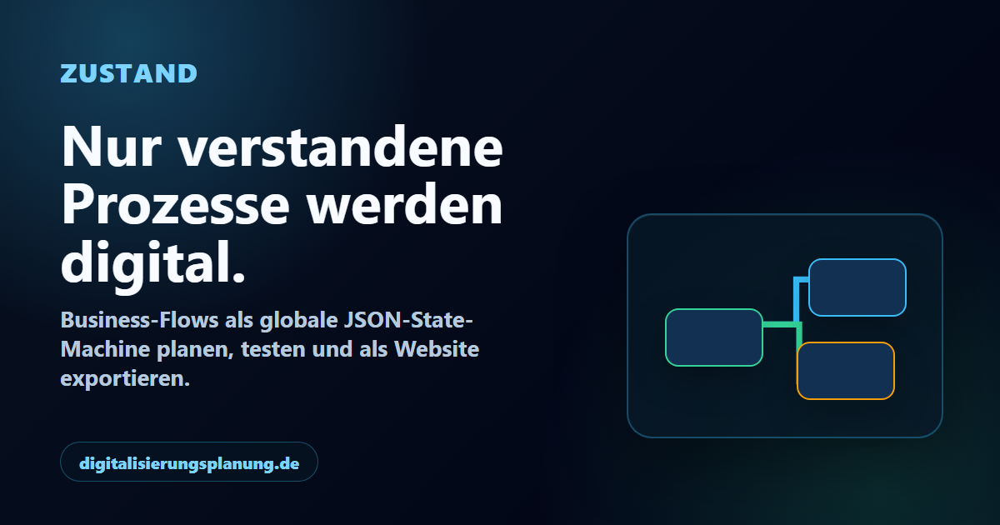

# Digitalisierungsplanung

Zustand macht Geschäftsprozesse sichtbar, prüfbar und ausführbar. Ein Ablauf wird als Zustandsdiagramm gebaut: Zustände, Übergänge, Auslöser, Bedingungen, Daten und Darstellung liegen in einem gemeinsamen JSON-Modell.

Der wichtigste Gedanke: Nur verstandene Prozesse lassen sich sauber digitalisieren.



## Einstieg

| Ziel | Adresse |
| --- | --- |
| Öffentliche Startseite | `https://digitalisierungsplanung.de/` |
| Werkzeug öffnen | `https://digitalisierungsplanung.de/state.html` |
| Beispiel im Werkzeug laden | `https://digitalisierungsplanung.de/state.html?demo=zustand` |
| Werkzeug mit Echtzeit-Raum | `https://digitalisierungsplanung.de/state.html?room=<raum-id>` |
| Echtzeit-Konsole | `https://realtime.digitalisierungsplanung.de/console.html?room=<raum-id>` |
| Echtzeit-Event-Designer | `https://realtime.digitalisierungsplanung.de/events-admin.html` |
| Ereigniskatalog | `https://realtime.digitalisierungsplanung.de/events` |
| Release-ID | `https://realtime.digitalisierungsplanung.de/version` |
| WebSocket | `wss://realtime.digitalisierungsplanung.de/ws` |

## Grundvertrag

Es gibt zwei fachliche Wahrheiten mit einer festen Grenze:

```text
normalisiertes JSON-Modell = persistierte Struktur
globaler JSON-Daten-/Ereignisbus = veränderliche Laufzeit
```

Regeln:

- Ein Zustand ist eine Sicht auf die Daten, die ihn betreffen.
- Ein Übergang verbindet zwei vorhandene Zustände.
- Ein Auslöser bewegt den Ablauf: Schaltfläche, Zeit, Datenänderung, API-Antwort oder Echtzeit-Ereignis.
- Bedingungen entscheiden, ob ein Übergang feuern darf.
- Darstellung liest Modell und Datenbus. Darstellung ist nie eigene Wahrheit.
- Text ist Anzeige. IDs sind Bindung.
- Vorlagen erzeugen erst Daten, wenn sie als echte Zustände genutzt werden.
- Verschachtelte Zustände laufen über echte Eingänge, Ausgänge und Verbindungen.
- Wenn kein echter Ausgang erreichbar ist, stoppt der Ablauf.
- Externe Ereignisse schreiben zuerst in den Datenbus. Erst danach kann ein Übergang reagieren.

Der ausführliche Vertrag steht in [`statereadme.md`](statereadme.md).

## Hauptdateien

- [`index.html`](index.html): veröffentlichte Startseite, aus dem Werkzeug exportiert
- [`state.html`](state.html): das komplette Werkzeug
- [`statereadme.md`](statereadme.md): Prinzipien, Architektur und Richtung
- [`docs/state-blueprint-api.md`](docs/state-blueprint-api.md): Programmierschnittstelle
- [`docs/state-blueprint-mcp.md`](docs/state-blueprint-mcp.md): MCP-Schnittstelle
- [`docs/realtime-api.md`](docs/realtime-api.md): Echtzeit-Schnittstelle

## Werkzeug

`state.html` enthält:

- Arbeitsfläche für Zustände und Übergänge
- Eigenschaften für Daten, Auslöser, Darstellung und Verbindungen
- App-Vorschau
- Vorlagen für häufige Oberflächenbausteine
- verschachtelte Zustände mit Eingang und Ausgang
- Datenladen beim Betreten eines Zustands
- Speichern, Laden, Einlesen und Ausgeben
- Echtzeit-Ereignisse aus `/events`
- PWA-Dateien und statische HTML-Ausgabe

Die öffentliche Startseite ist ein exportierter Ablauf. Im Werkzeug kann dieselbe Beispielseite über `state.html?demo=zustand` geöffnet werden.

Startseite neu erzeugen:

```bash
npm run build:index
```

PWA-Bilder neu erzeugen:

```bash
npm run build:pwa-assets
```

Gemeinsame Frontend-/Backend-Release-ID lokal um eins erhöhen:

```bash
npm run build:release-version
```

CI führt denselben Schritt erst nach allen Verträgen aus. Die Datei enthält
danach beispielsweise `release-59`; `/version` und `/healthz` melden exakt
dieselbe ID für den Backend-Prozess.

Die App registriert keinen Service Worker. `disable-sw.js` und der
`sw.js`-Tombstone melden noch vorhandene alte Worker ab und löschen ausschließlich
alte Cache-Storage-Bestände; es gibt keinen Fetch-Interceptor und keinen Cache.

## Echtzeit

Der Server in [`server/`](server/) ist nur Transport. Er speichert keine fachlichen Daten und besitzt kein zweites Modell.

| Route | Zweck |
| --- | --- |
| `GET /healthz` | Gesundheitsprüfung |
| `GET /version` | gemeinsame Frontend-/Backend-Release-ID |
| `GET /contract` | zentraler Product Contract: Trigger-Typen, Datentypen, Datasets, Quellen, Presets, Preset-Pakete, Abo-Pläne und State-Beiträge |
| `GET /events` | aktueller Echtzeit-Contract mit Quellen |
| `GET /events/contract` | niedriger Realtime-Katalog-Contract mit Detail-Typen und State-Beiträgen |
| `GET /token` | signiertes Raum-Token für den Browser |
| `GET /console.html` | Testoberfläche für Ereignisse |
| `GET /events-admin.html` | einfacher Designer für Event-Type, Datensatz und Felder |
| `GET/POST /events-admin/catalog` | validieren, committen und pushen von `server/event-catalog.json` |
| `POST /emit` | authentifiziertes Ereignis von außen |
| `WSS /ws` | WebSocket-Verbindung |

Der harte Contract kommt aus [`server/event-catalog.json`](server/event-catalog.json)
und wird vom Server unter `/contract` als Product Contract ausgeliefert:
Trigger-Typen, Value-Types mit Constraints, `realtime.*`-Datasets, Quellen,
Standard-Presets aus `server/preset-catalog.js`, Preset-Pakete,
Abo-Pläne und kollisionsfreie State-Beiträge. Jedes Contract-Feld liefert neben `fieldTypes`
auch `fieldSchemas` mit `type`, `jsonType`, `default` und `constraints`
wie `min`, `max`, `maxLength`, `format`, `protocols`, `maxDepth` oder
`maxItems`. `/emit` und WebSocket-Runtime-Events prüfen dieselben Schemas,
bevor ein Event in den Raum darf. `/events` bleibt der schlanke Live-Katalog
für Realtime-Events. Der Canvas speichert keine Katalogkopie, sondern nur
konkrete Referenzen wie `triggerType: realtime` und `triggerEvent`.
`state.html` lädt `/contract` beim Start mit `no-store`; wenn der Product
Contract nicht erreichbar ist, startet der Editor nicht mit lokalen
Fallback-Typen oder lokalen Preset-Definitionen.

Preset-Pakete sind reine Server-Metadaten für Verkauf, Anzeige und spätere
Freischaltung. Der Canvas speichert keine Paketkopie; ein Preset schreibt
weiter nur seinen eindeutigen `stateContribution` in den globalen JSON-State.
Die drei Standard-Abos sind `starter`, `business` und `scale`. Zusatzpakete
wie `bi.analytics`, `sales.crm`, `knowledge.portal` und
`integration.automation` bleiben auch neben dem größten Paket separat
zubuchbar.

Der Designer arbeitet in der gleichen Reihenfolge wie der Canvas-Vertrag:
Event-Type, Dataset-Key, Felder, Quelle. Das Admin-Secret bleibt lokal im
Browser gespeichert; beim Speichern validiert der Server den Contract, committet
`server/event-catalog.json` und `release-version.js` als eine Einheit und pusht
nach GitHub. Es gibt kein Pinning alter Contract-Versionen: Runtime und
Frontend verwenden immer den aktuellen `release-N`-Stand.

Ein Ereignis von außen senden:

```bash
curl -X POST https://realtime.digitalisierungsplanung.de/emit \
  -H "authorization: Bearer $REALTIME_EMIT_SECRET" \
  -H "content-type: application/json" \
  -d '{"roomId":"demo","emitterId":"sip.threecx","name":"realtime.sip.call.incoming","detail":{"caller":"+491234","callee":"100","callId":"abc-123"}}'
```

Dazu passender Übergang im Werkzeug:

```text
triggerType: realtime
triggerEvent: realtime.sip.call.incoming
```

Der Browser-Ursprung ist produktiv auf `https://digitalisierungsplanung.de` begrenzt.

## Server-Veröffentlichung

Der Echtzeit-Server läuft auf dem Droplet lokal unter `127.0.0.1:8788`. Nginx veröffentlicht ihn unter `realtime.digitalisierungsplanung.de`.
`index.html`, `state.html`, Assets und `release-version.js` bleiben auf der Root-Domain `digitalisierungsplanung.de` und werden nicht vom Droplet ausgeliefert.

Wichtige Dateien:

- [`server/server.js`](server/server.js): Server
- [`server/ecosystem.config.cjs`](server/ecosystem.config.cjs): PM2-Prozess
- [`server/deploy.sh`](server/deploy.sh): Veröffentlichung auf dem Droplet
- [`server/auto-deploy.sh`](server/auto-deploy.sh): atomare automatische Aktualisierung
- [`server/nginx/realtime.digitalisierungsplanung.de.conf`](server/nginx/realtime.digitalisierungsplanung.de.conf): produktive Nginx-Datei
- [`server/nginx/realtime.digitalisierungsplanung.de.bootstrap.conf`](server/nginx/realtime.digitalisierungsplanung.de.bootstrap.conf): erste HTTP-Konfiguration für Zertifikate

Server deployen und automatische Aktualisierung installieren oder auffrischen:

```bash
cd /var/www/digitalisierungsplanung.de
git fetch --prune --force origin +refs/heads/main:refs/remotes/origin/main
git reset --hard origin/main
git clean -ffd
sudo bash server/deploy.sh
```

`deploy.sh` installiert oder aktualisiert den Systemd-Timer am Ende automatisch.
Danach prüft der Timer jede Minute `origin/main`. Er reagiert erst auf
eine nach vollständigem CI-Lauf hochgezählte `release-N`-ID, verwirft lokale
Änderungen im Server-Checkout, deployt exakt den freigegebenen Commit und prüft
PM2, Nginx sowie die gleiche ID in `/healthz`. Bei einem Fehlschlag wird der
Marker nicht weitergeschrieben; der Timer versucht denselben neuesten grünen
Release erneut. Nicht freigegebene `main`-Zwischenstände werden nicht deployed.

```bash
sudo bash server/auto-deploy.sh --once
sudo bash server/auto-deploy.sh --status
journalctl -u digitalisierungsplanung-auto-deploy.service -n 100 --no-pager
```

Secrets bleiben außerhalb des Repositories in
`/etc/digitalisierungsplanung-realtime.env`. `origin/main` gewinnt im
Anwendungsverzeichnis ausdrücklich gegen lokale Dateien und Änderungen.

Produktive Prüfungen:

```bash
npm run server:smoke:wss:prod
npm run server:smoke:emit:prod
```

## API und MCP

Die Schnittstellen bearbeiten dasselbe Modell wie das Werkzeug. Sie klicken nicht die Oberfläche und halten keinen zweiten Speicher.

Start:

```bash
STATE_BLUEPRINT_MODEL_PATH=./state-blueprint.workspace.json npm run mcp:state
```

Wichtige Werkzeuge:

- `state_blueprint_get_model`
- `state_blueprint_replace_model`
- `state_blueprint_apply_actions`
- `state_blueprint_plan_prompt`
- `state_blueprint_apply_prompt`
- `state_blueprint_validate`
- `state_blueprint_export_definition`
- `state_blueprint_export_html`
- `state_blueprint_import_definition`
- `state_blueprint_action_catalog`

Dokumentation:

- [`docs/state-blueprint-api.md`](docs/state-blueprint-api.md)
- [`docs/state-blueprint-mcp.md`](docs/state-blueprint-mcp.md)

## Entwicklung

Installieren:

```bash
npm install
```

Server lokal starten:

```bash
npm run server:start
```

Tests:

```bash
npm test
npm run test:server
npm run test:contracts
npm run test:full
```

Gezielte Prüfgruppen:

```bash
npm run test:state-explorer
npm run test:state-render
```

`npm test` führt die Server-Tests und die wichtigsten Playwright-Abläufe aus. `npm run test:full` führt den vollständigen Bestand lokal aus. GitHub Actions verteilt dieselben Browserfälle vollständig auf vier parallele Shards, führt die Serverfälle einmal aus und erhöht nach jedem Gesamterfolg auf `main` die gemeinsame Release-Sequenz in `release-version.js`.

## Ordner

```text
.
|-- index.html
|-- state.html
|-- manifest.webmanifest
|-- disable-sw.js
|-- sw.js
|-- release-version.js
|-- package.json
|-- playwright.config.js
|-- statereadme.md
|-- CNAME
|-- assets/
|-- docs/
|-- mcp/
|-- scripts/
|-- server/
|-- tests/
|-- .github/workflows/deploy.yml
`-- .gitea/workflows/test.yml
```

## Veröffentlichung

1. Änderungen auf `main` pushen.
2. GitHub Actions führt alle Server- und Browserfälle in vier vollständigen Browser-Shards aus.
3. Nach grünem Lauf wird die gemeinsame `release-N`-ID in `release-version.js` inkrementiert.
4. GitHub Pages veröffentlicht die Root-Domain-Dateien.
5. Der Droplet-Timer erkennt die neue ID, synchronisiert den Remote-Stand mit Force und deployt/verifiziert nur `realtime.digitalisierungsplanung.de`.

Anspruch: ein schlanker Kern, ein Modell, ein Datenbus, eine ausführbare Oberfläche.
